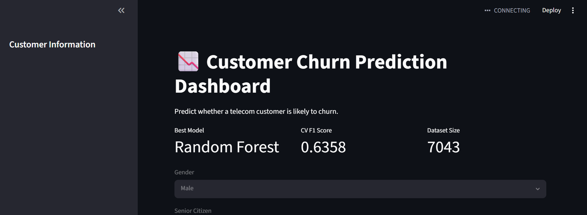

# Customer Churn Prediction

## Overview

This project predicts whether a telecom customer is likely to churn using Machine Learning.

## Business Problem

Customer churn causes revenue loss for telecom companies.
This project helps identify customers at risk of leaving.

## Dataset

IBM Telco Customer Churn Dataset

Rows: 7043

Features: 20+

Target: Churn

## Project Workflow

- Business Understanding
- Data Cleaning
- Exploratory Data Analysis
- Feature Engineering
- Model Training
- Hyperparameter Tuning
- Cross Validation
- Model Deployment

## Models Tested

- Logistic Regression
- Decision Tree
- Random Forest
- KNN
- Naive Bayes
- XGBoost

## Best Model

Tuned Random Forest

Cross Validation F1 Score: 0.6358

## Streamlit Dashboard

Features:

- Churn Prediction
- Risk Analysis
- Probability Score
- Customer Information Dashboard

## Technologies

- Python
- Pandas
- NumPy
- Scikit-Learn
- XGBoost
- Streamlit
- Joblib
## Dashboard

## Author

Hafsa Komal
Machine Learning Engineer